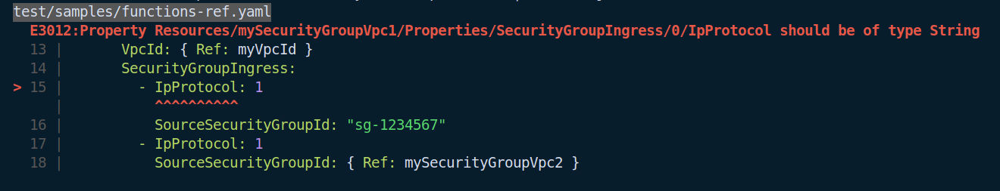

# Code Frame output for AWS CloudFormation Linter

This CLI tool reads the `parseable` output from the python tool [cfn-lint][]
from stdin and prints out a more human friendly output.

Example:

[cfn-lint]: https://github.com/aws-cloudformation/cfn-python-lint



## Installation

```sh
npm install -g cfn-lint-to-codeframe
```

## Usage

Make sure to pass `--format parseable` to `cfn-lint`

```
cfn-lint --template my-template.json --format parseable | cfn-lint-to-codeframe
```
